# Overview and user interface

The {{app_name}} provides a user interface structured into a series of views, each corresponding to a specific step in the Matter accessory device setup process. Users can navigate through these steps by clicking to move forward or backward between the views, allowing them to follow the instructions at their own pace and revisit previous steps if needed.

When you start the {{app_name}}, the application automatically scans for devices connected to the serial ports of your PC. If only one compatible device is detected, the application will automatically establish a connection to it. If multiple compatible devices are found, a list of detected devices will be presented for user selection.

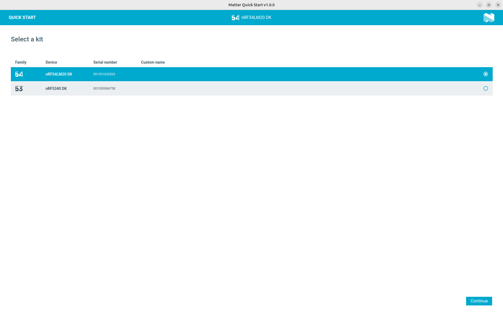

## Selecting Matter sample firmware

After connecting to your device, you will be prompted to choose the Matter sample firmware to be programmed onto your development kit. The available Matter samples depend on the specific development kit you are using.

If you are using an nRF52840 DK, nRF5340 DK, nRF54L15 DK, or nRF54LM20 DK, the application supports the following Matter samples:

- [Matter Door Lock](https://docs.nordicsemi.com/bundle/ncs-latest/page/nrf/samples/matter/lock/README.html)
- [Matter Light Bulb](https://docs.nordicsemi.com/bundle/ncs-latest/page/nrf/samples/matter/light_bulb/README.html)
- [Matter Temperature Sensor](https://docs.nordicsemi.com/bundle/ncs-latest/page/nrf/samples/matter/temperature_sensor/README.html)
- [Matter Contact Sensor](https://docs.nordicsemi.com/bundle/ncs-latest/page/nrf/samples/matter/contact_sensor/README.html)

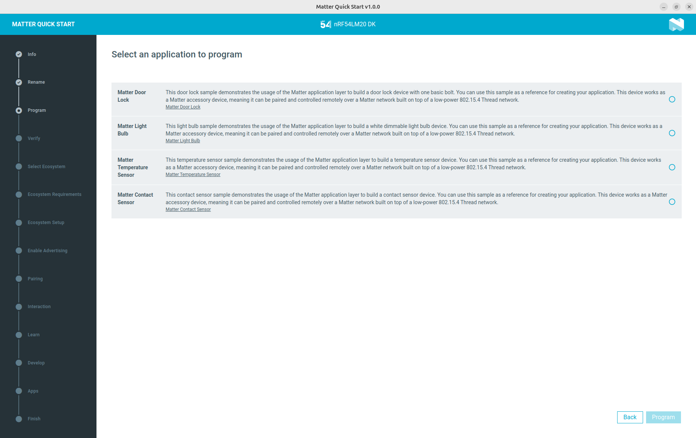

For the Nordic Thingy:53, the application supports the [Matter Weather Station](https://docs.nordicsemi.com/bundle/ncs-latest/page/nrf/applications/matter_weather_station/README.html) application.

Select the desired sample firmware for your device. The application will guide you through the programming process and subsequent steps for integrating your device with a compatible smart home ecosystem.

!!! info "Note"
    The Nordic Thingy:53 does not include an on-board JLink programmer therefore, programming is performed via Device Firmware Upgrade (DFU) over USB. Consequently, the application provides step-by-step guidance for putting the Thingy:53 into bootloader mode and learns how to verify that the memory partitions are compatible with the selected firmware prior to uploading.

    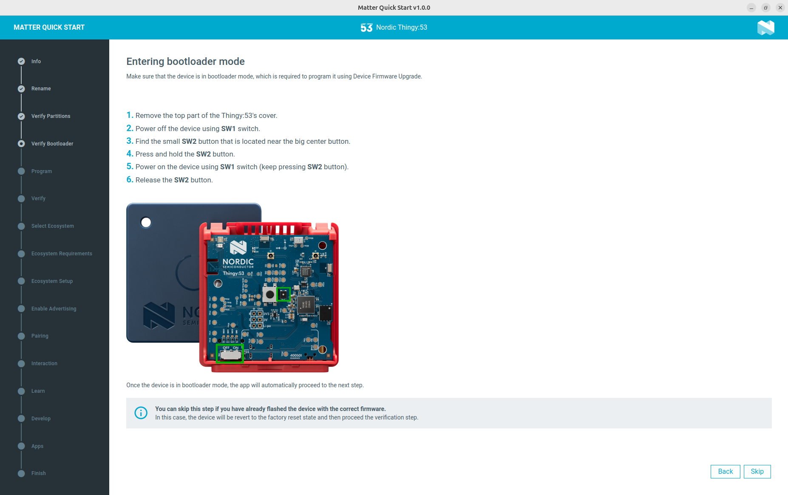

## Programming and verifying the firmware

After you have selected the desired firmware, the application will guide you to a dedicated programming view. In this view, you can initiate the programming process, and the application will display real-time progress as the firmware is written to your device.

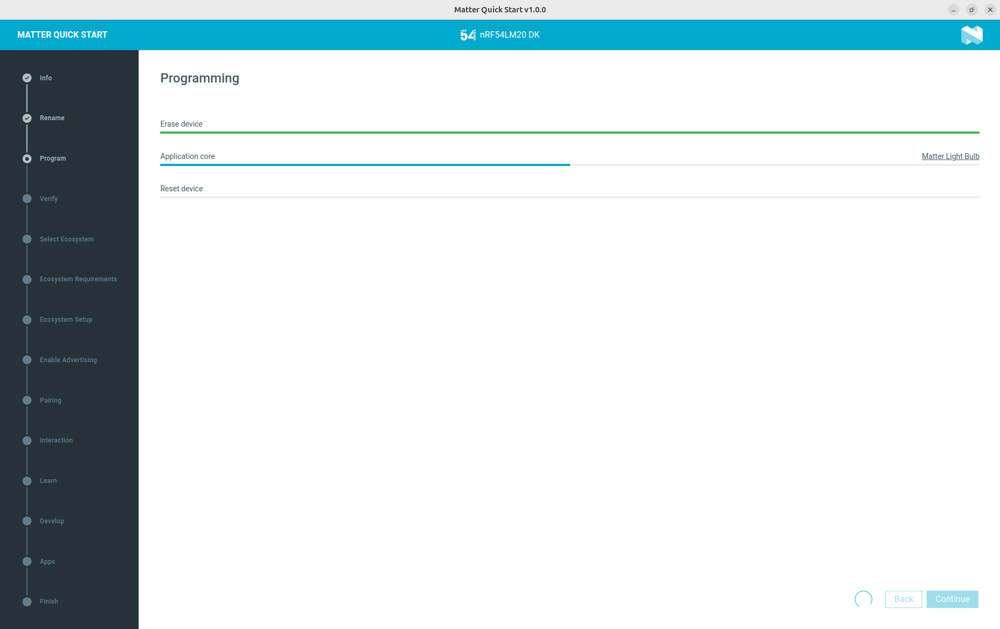

Once programming is complete, the application advances to a verification view. Here, it automatically monitors the device's output logs via the serial port to confirm that the firmware is running correctly. The application analyzes these logs to ensure that the device has started up as expected and is functioning properly, providing you with immediate feedback on the success of the flashing process.

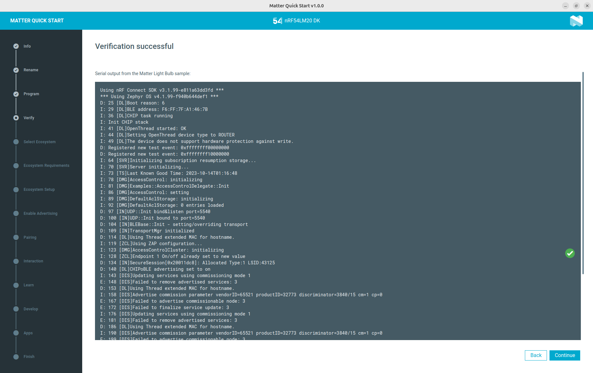

## Selecting comatible commercial ecosystem

Commercial smart home ecosystems do not support all Matter device types described by the Matter specification. When you select a specific Matter sample firmware, the application will only display ecosystems that are compatible and support that particular device type. This means that the list of available ecosystems may vary depending on your sample selection. The full list of ecosystems supported by the {{app_name}} is as following:

- Apple Home
- Google Home
- Amazon Alexa
- Samsung SmartThings

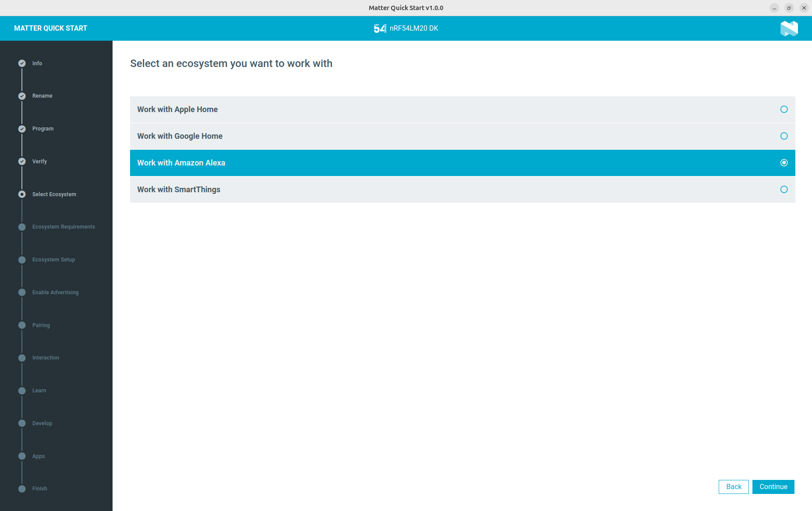

## Setting up an ecosystem to work with Matter

Before you can connect and control Matter accessories with a commercial ecosystem, you must first set up that ecosystem to support Matter. Each commercial ecosystem requires specific devices, like a smart speaker or hub and a compatible mobile application to enable Matter functionality.

The {{app_name}} informs you about the required devices, as well as the necessary mobile application. It also presents detailed, step-by-step  instructions to help you prepare your ecosystem to work with Matter accessories. Additionally, the app includes sample videos recorded from the actual mobile applications, allowing you to see exactly how to perform each step in the setup process.

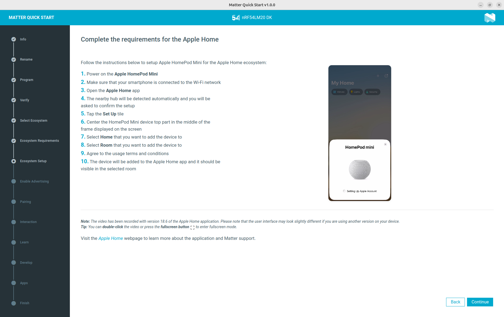

## Pairing and controlling the Matter accessory device

Once you have selected and set up your preferred ecosystem, you can proceed to pair your Matter accessory device with the corresponding mobile application. The {{app_name}} provides highly detailed, step-by-step pairing instructions, including videos recorded directly from real mobile apps. These resources are tailored for each supported ecosystem and every available Matter sample, ensuring that you receive guidance specific to your device and ecosystem combination.

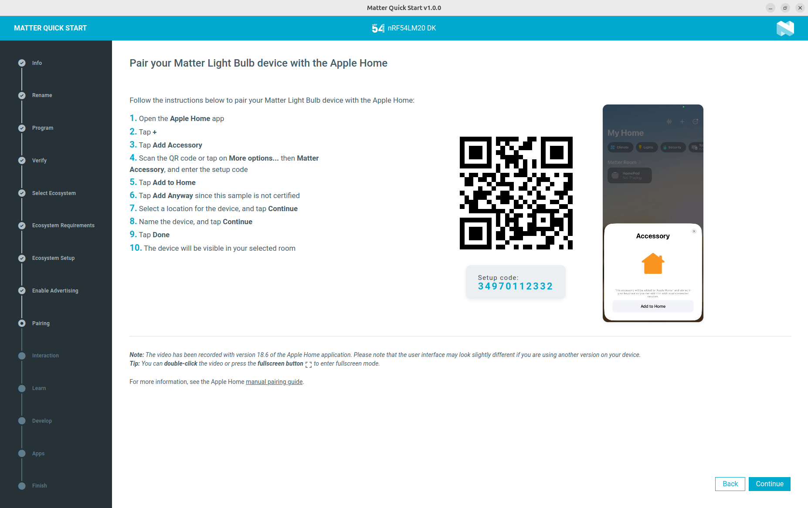

For each device type, the instructions and videos are customized to demonstrate not only the pairing process but also how to interact with the device after pairing. For example, if you are using a Matter Light Bulb, the videos will show how to adjust brightness and toggle the light on or off. If you are working with a Matter Contact Sensor, the instructions will include demonstrations of how to view the sensor state and interpret its status within the app. This level of detail ensures that you can confidently pair and use your Matter accessory, regardless of the device or ecosystem you choose.

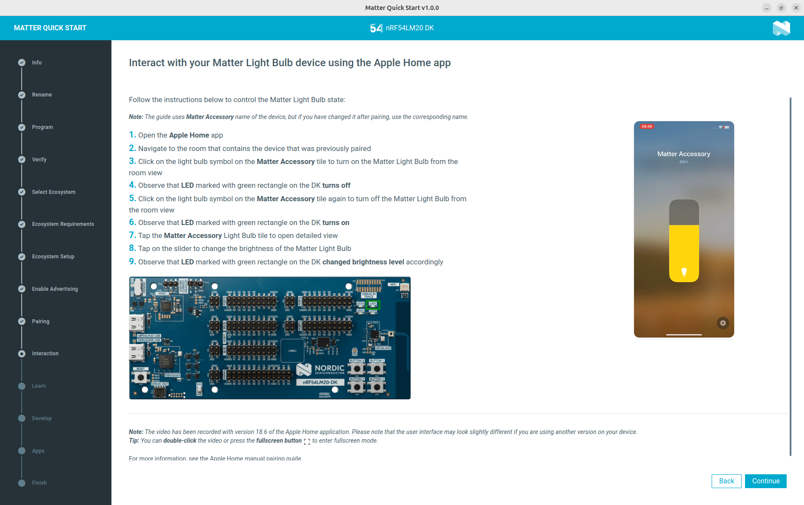

## Learning and developing

At the end of the setup and evaluation process, the application will present you a selection of additional resources to help you learn more about Matter and the solutions provided by Nordic Semiconductor. This includes links to documentation, tutorials, and other educational materials relevant to Matter technology and Nordic's offerings.

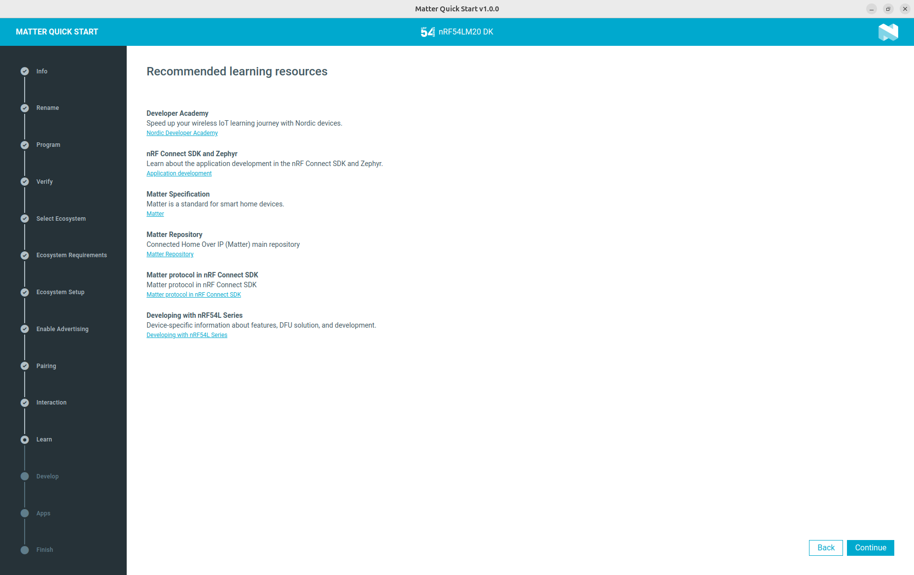

The application also features a dedicated view that highlights useful tools which can be downloaded to assist you during the Matter product development process. These tools are designed to streamline development, testing, and debugging of Matter devices.

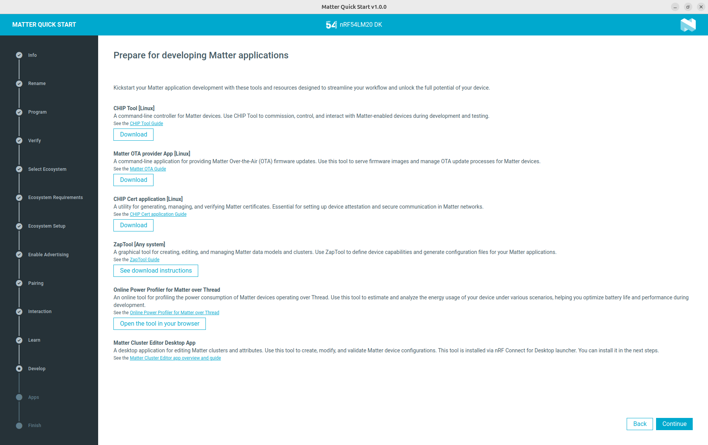

Additionally, you will have the opportunity to install other tools that are compatible with the nRF Connect for Desktop launcher. For example, the Matter Cluster Editor is another valuable tool for Matter product development, allowing you to customize or create own manufacturer specific clusters for your Matter device.

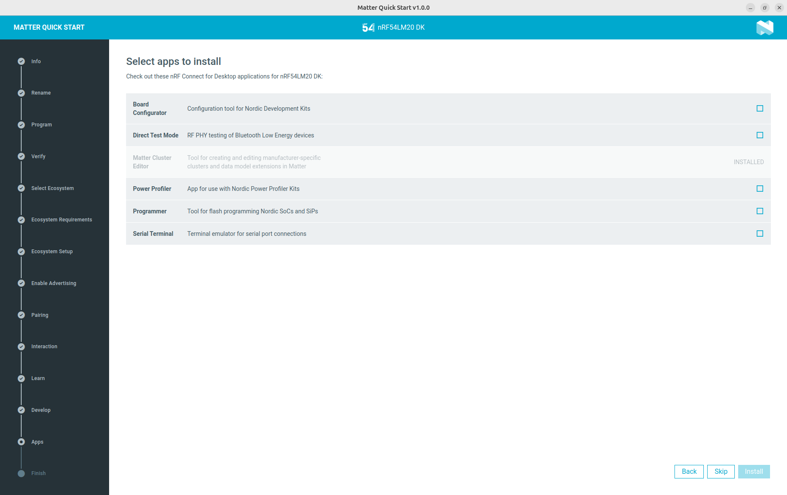

The application will guide you to these resources, ensuring you have everything you need to continue your Matter development journey with Nordic Semiconductor.
